Styes are used to set the visual appearance of the widgets.

Style for the widget can be set locally or, optionally, by using reusable style definitions defined in the Styles panel.

Locally defined widget styles in EEZ-GUI project:

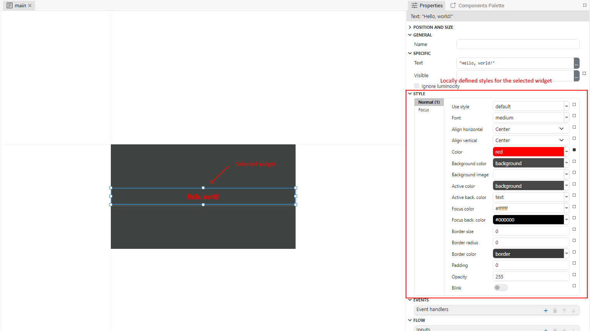

Locally defined widget styles in Dashboard project:

Locally defined widget styles in LVGL project:

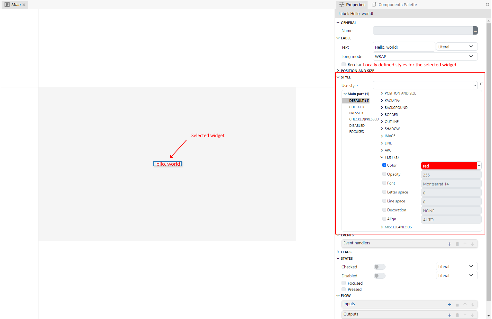

By using style definitions, instead of local style modifications, you are achiving consistency (widgets with the similar purpose has the same visual apperance) and maintability (change in reusable style definition is automatically propagated in all widgets that are using it).

Style definitions are inheritable, that means one style definition can inherit from other style definition. I.e. child style inherits all the properties from the parent style.

In the same way, locally defined widget style inherits all the properties from the style definition it uses. In this case, locally defined style is child style, and style definition it uses is parent style.

There are some differences how styles are defined in varius types of project (EEZ-GUI, Dashboard and LVGL) which will be explained in various places in this chapter.

For example, here are shown locally defined styles for the Button widget in EEZ-GUI project:

-   For the Button widget we can define two styles, one for the normal button and the other for the disabled button.

-   Here, we can see that `button` style definition is used as parent style (this is set with "Use style" property). Also, there is one locally made change in `Color` property (`Color` property is used to change the color of the widget text). To reset this change, and to use the color property from the parent style (which is `button` in this case), click on the dark rectangle at the right side of the property and select Reset from the popup menu:

-   Rectangle at the right side of the property can be filled or empty. Filled rectangle means that property is locally changed and will not be inherited from the parent style. If rectangle is empty then trough tooltip we can find from which ancestor style this property is inherited:

In the Styles panel, the style hierarchy (i.e. parent-child relationship) is defined by using drag and drop. If you want some style to become the child of another then drag child style and drop it inside the parent style. For example, in the following screenshot, `button_disabled` style is child of the `button` style, who is child of the `default` style:

# Style properties

## EEZ-GUI project

Here is shown the example of editing style locally for the LineChart widget

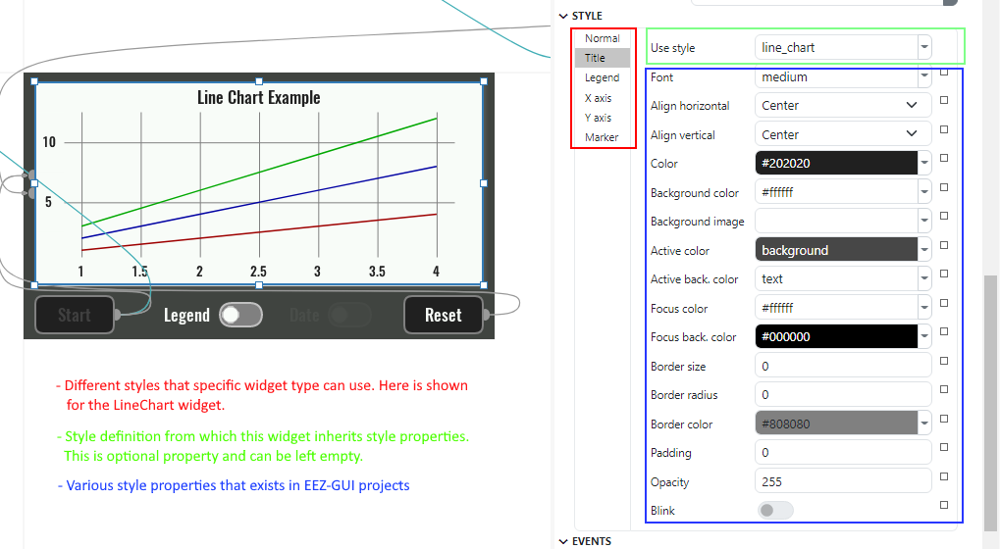

Here we can see that depending of the widget type we can have one or more styles which are used in different parts of widget visual apperance. For example for the LineChart widget we have: Normal, Title, Legend, X axis, Y axis and Marker style definitions.

For each style definition we have the following properties:

(In properties below, color value is either hex color definition (for example: `#ab2a18`) or color name as defined in Themes panel.)

-   `Use style`: The name of the style definition from which this widget inherits style properties. If there is some locally modified property then it has precedence over this style definition. This property can be left empty, which means that this widget doesn't inhertits any property from some style definition and only local modifications are used.

-   `Font`: The font for the texts displayed inside this widget.

-   `Align horizontal`: Horizontal text alignment.
-   `Align vertical`: Vertical text alignment

-   `Color`: The color of the text.
-   `Background color`: The background color of the widget
-   `Background image`: The backround image of the widget

-   `Active color`: The color of the text when widget is active. For example:
    -   button widget is active when it is clicked
    -   when `Blink` property is enabled in Text widget it switches periodicallu between Normal and Active state.
-   `Active back. color`: The background color of the widget when it is active.

-   `Focus color`: The color of the text when widget is in focus.
-   `Focus back. color`: The background color of the widget when it is in focus.

-   `Border size`: This is the line width used to draw border.
-   `Border radius`: The radius of the border corner. This can be given as 1 number, 2 numbers or 4 numbers separated with the space character, with the following meaning:
    -   `radius` - set for all corners the same value for the radius
    -   `radius1 radius2` - different radiuses for top-left/bottom-right corner (radius1) and for top-right/bottom-left corner (radius2)
    -   `radius1 radius2 radius3 radius4` - set for each corner, i.e. top-left, top-right, bottom-right and bottom-left - in that order, a different value
-   `Border color`: The color used to paint the border

    Examples:

    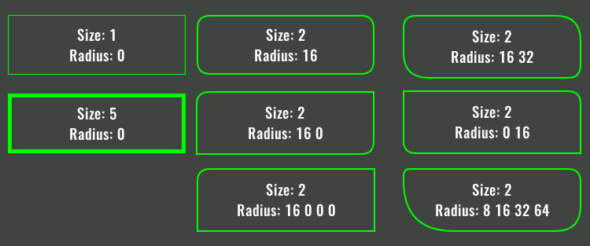

-   `Padding`. The offset of the text. This can be given as 1 number, 2 numbers or 4 numbers separated with the space character, with the following meaning:

    -   `padding` - set the same number for all the sides
    -   `padding1 padding2` - `padding1` is for top/bottom and `padding2` is for left/right
    -   `<padding1> <padding2> <padding3> <padding4>` - set for each side, i.e. top, right, bottom and left - in that order, a different value

-   `Opacity`. 0 - fully transparent, 255 - fully opaque.

-   `Blink`. If enabled, the widget periodically switches between Normal and Active State. Use different normal and active colors to achieve blink effect.

## Dashboard project

Dashbord project styles are based on CSS styles: https://developer.mozilla.org/en-US/docs/Web/CSS.

For each property there is a Help link to open a coresponding CSS property help page on the mozilla web site:

`Use style` property is the same as in EEZ-GUI project.

For the following properties, please consult CSS documentation for the meaning:

    - Font family
    - Font weight
    - Font style
    - Align horizontal
    - Align vertical
    - Direction
    - Color
    - Background color
    - Background image
    - Active color
    - Active back. color
    - Focus color
    - Focus back. color
    - Border size
    - Border radius
    - Border style
    - Padding
    - Opacity
    - Box shadow

Use `Blink` property to achieve widget blinking. You can check, in the `CSS preview` read only field, the generated CSS when this property is enabled:

Use `Additional CSS` property to enter any custom CSS properties.

In CSS preview field there is a summary of the all CSS properties genereted for the style, including parent styles and local modifications (commented as `/* inline style */`).

## LVGL project

Style definition in LVGL project are grouped in parts and states. Each widget type can have different parts which can be differently customised with the styles. For each widget state (normal, pressed, focused, ...) different style properties can be set.

For example, slider widget has three different parts: Main, Indicator and Knob:

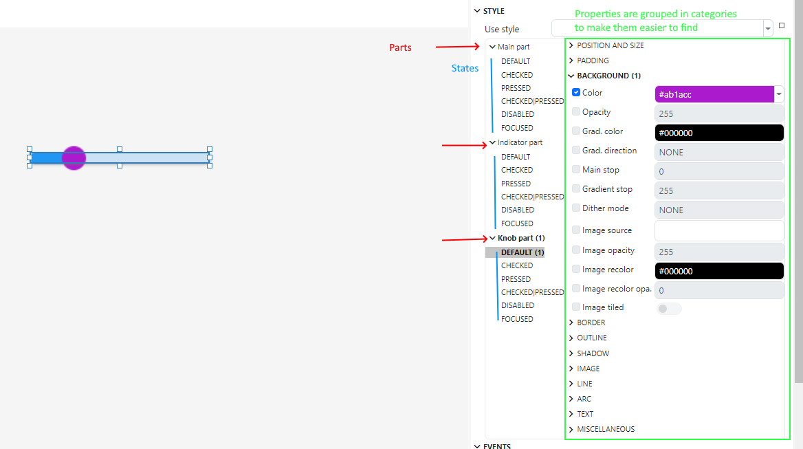

Differently from the EEZ-GUI and Dashboard project, style properties are modified by checking the checkbox left to property name.

In the category name, state name and part name there is an indication how many properties are changed:

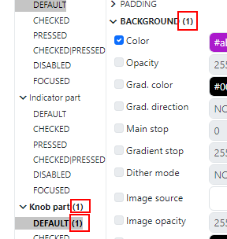

To learn more about LVGL styles please consult https://docs.lvgl.io/latest/en/html/overview/style.html, and particularly https://docs.lvgl.io/latest/en/html/overview/style.html#properties for the list with explanations of each LVGL style property.

# Styles panel

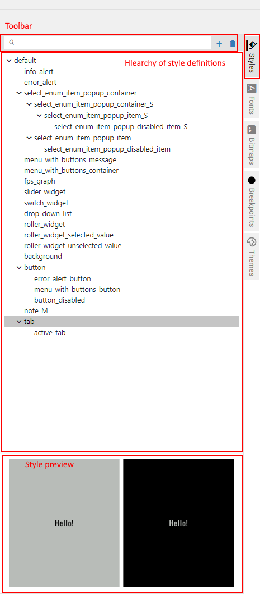

## Creating a new style defintion

To create a new style definition, click the `+` icon in styles panel to open a New Style dialog:

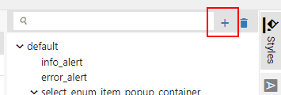

New Style dialog for the EEZ-GUI and Dashboard project looks like this:

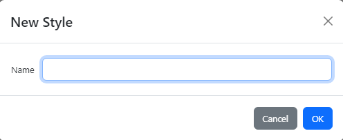

and for the LVGL project looks like this:

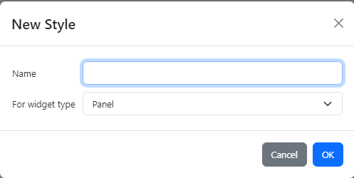

The `Name` property is used to set the name of the newly created style definition which must be unique inside the project. The `For widget type` property, which exists only for the LVGL projects, is the Widget type for which we want to create a new style. Therefore, this style can only be used for that specific widget type.

There is also a convinient way to create a new style definition from the widget locally defined style by using popup menu of the "Use style" property:

-   `Reset All Modification`: this will reset (clear) all local modification for this widget

-   `Create New Style`: this will create a new style from local modifications and also make this widget use newly created style.

-   `Update Style`: if widget is using some style and have some local modification then it will update that style with those local modifications

## Style Hiearchy

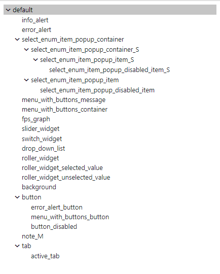

All defined styles and relationship between them are presented inside style hiearchy view. Use drag and drop to set a parent-child relationship between two styles, i.e. drop child style inside parent style.

For the LVGL projects there is also an icon in this view indicating for which widget type specific style is intended to be used:

## Style Preview

For the EEZ-GUI and Dashboard projects, Style Preview view can be found below Style Hiearchy view. What is shown is two versions of the preview, one when `Color`/`Background Color` is used and other when `Active Color`/`Active Back. Color` is used:

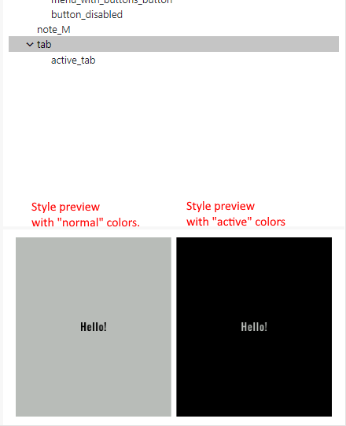

For the LVGL project, preview is shown as View tab in Editors/Views tabset:

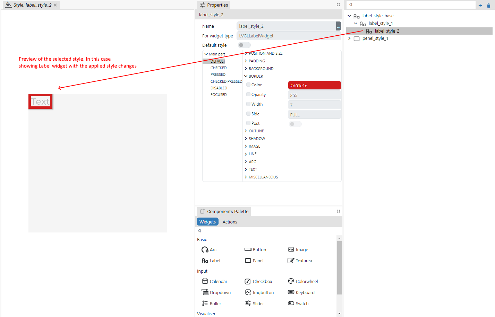
