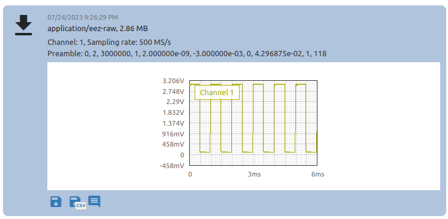
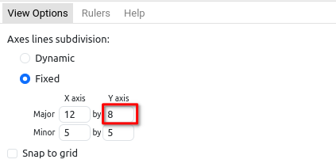

# DESCRIPTION

It is used to add a new item to the _History_ view of the instrument. Currently, only adding chart items is supported.

For example in the _Rigol Waveform Data_ example we have this Action:

It is used to add a chart which, after successful addition, will be displayed as follows (example of test signal acquisition):

# PROPERTIES

## Instrument

An instrument in whose _History_ an item will be added.

## Item type

Item type to be added. It can be `"Chart"` or `"Plotly"`.

## Chart description

Description of the chart displayed in the instrument _History_:

This property is only available when `Item type` is `Chart`.

## Chart data

A string or blob containing the samples that will be displayed in the chart.

This property is only available when `Item type` is `Chart`.

## Chart sampling rate

Sampling rate or number of samples per second (SPS).

This property is only available when `Item type` is `Chart`.

## Chart offset

Offset value used in formula `offset + sample_value * scale` which transforms sample value to sample position on y axis in the chart.

This property is only available when `Item type` is `Chart`.

## Chart scale

When displaying samples, the formula `offset + sample_value * scale` is used.

This property is only available when `Item type` is `Chart`.

## Chart format

Format from `Chart data`. Possible values:

-   `"float"` – "Chart data" must be a blob containing 32-bit, little-endian float numbers.
-   `"double"`– "Chart data" must be a blob containing 64-bit, little-endian float numbers.
-   `"rigol-byte"` – "Chart data" must be a blob containing 8-bit unsigned integer numbers.
-   `"rigol-word"` – "Chart data" must be a blob containing 16-bit unsigned integer numbers.
-   `"csv"` – "Chart data" must be a CSV string, the first column is taken.

This property is only available when `Item type` is `Chart`.

## Chart unit

The unit displayed on the Y-axis. The X-axis is always time.

This property is only available when `Item type` is `Chart`.

## Chart color

The color of the line in the chart if a dark background is selected.

This property is only available when `Item type` is `Chart`.

## Chart color inverse

The color of the line in the chart if the light background is selected.

This property is only available when `Item type` is `Chart`.

## Chart label

Chart label:

This property is only available when `Item type` is `Chart`.

## Chart major subdivision horizontal

This property is only available when `Item type` is `Chart`.

## Chart major subdivision vertical

This property is only available when `Item type` is `Chart`.

## Chart minor subdivision horizontal

This property is only available when `Item type` is `Chart`.

## Chart minor subdivision vertical

This property is only available when `Item type` is `Chart`.

## Chart horizontal scale

The number that defines the X-axis zoom factor in the default chart view.

This property is only available when `Item type` is `Chart`.

## Chart vertical scale

The number that defines the Y-axis zoom factor in the default chart view.

This property is only available when `Item type` is `Chart`.

## Plotly widget

Reference to the LineChart widget. See `Output widget handle` property to find out how to obtain this reference.

This property is only available when `Item type` is `Plotly`.

# INPUTS

## seqin

A standard sequence input.

# OUTPUTS

## seqout

A standard sequence output.

## id

ID of the added history item. We can, for example, use this data in the `Chart` Widget to display the chart history item inside the dashboard.

# EXAMPLES

-   _Rigol Waveform Data_
