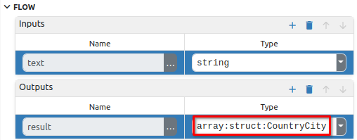

# DESCRIPTION [DRAFT]

Parsira JSON string, konstruira vrijednost zadanog tipa i šalje je kroz `result` output.

# PROPERTIES

## Value [DRAFT]

Ovo je JSON string koji se parsira.

# INPUTS

## seqin [DRAFT]

A standard sequence input.

## text [DRAFT]

Input preko kojeg se prima JSON string koji se parsira. Ovaj input se može obrisati (briše se u Flow - Inputs listi) ako nije potreban, tj. ako se želi parsirati string koji se dobije evaluacijom proizvoljnog expressiona zadanog kroz `Value` property.

# OUTPUTS

## seqout [DRAFT]

A standard sequence output.

## result [DRAFT]

Data output na koji se šalje konstruirana vrijednost. Ovdje se mora specificirati tip te vrijednosti - to se treba obaviti u Flow - Outputs sekciji:



Npr. u primjeru koji smo uzeli iz JSON examplea, imamo JSON string koji izgleda ovako:

```
[
    {
        "country": "Afghanistan",
        "city": "Kabul"
    },
    {
        "country": "Albania",
        "city": "Tirana"
    },
    {
        "country": "Algeria",
        "city": "Alger"
    },
    ...
]
```

Znači konstruirana vrijednost koju vraća ova akcija treba biti tipa `array:CountryCity`, gdje je `CountryCity` struktura koja ima dva fielda (naziv strukture `CountryCity` je proizvoljno odabrana od strane developera):

-   `country`, tipa `string`
-   `city`, tipa `string`

Ovako definicija te strukture izgleda u project editoru:


# EXAMPLES [DRAFT]

    - JSON
