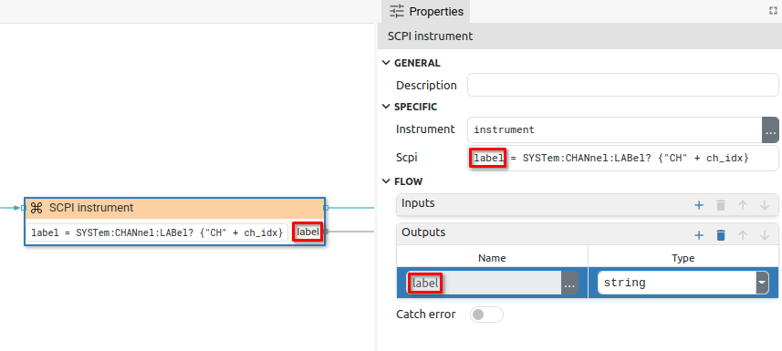

# DESCRIPTION [DRAFT]

Izvršava, na zadanom instrumentu, redom jednu ili više SCPI komanda ili upita. Kada se sve komande/upiti izvrŠe izlazi se na `seqout` output.

# PROPERTIES

## Instrument [DRAFT]

Instrument object na kojem se izvršavaju komande/upiti. Ovaj property je prisutan samo unutar Dashboard projekta gdje se na instrument spajamo remotly, tj. moguće se istovremeno spojiti na više instrumenata. Ako je u pitanju EEZ-GUI projekt, onda ovaj property ne postoji jer uvijek koristimo upravo board na kojem se flow izvršava i njemu šaljemo SCPI komande.

## Scpi [DRAFT]

Lista komandi/upita. Svaka komanda/upit se mora napisati u zasebnoj liniji. Unutar komande/upita se može ubaciti i Flow expression, koji se mora upisati između dvije vitičaste zagrade. Ovo je primjer preuzet iz BB3 Dashboard examplea koji koristi Flow expression unutar SCPI komande:

Također u gornjem primjeru se dodao Flow Catch Error kako bi se ulovila greška tijekom izvršavanja SCPI komponente.

Za upit se mora specificirati gdje se šalje rezultat, i tu imamo dvije mogućnosti:

-   Slanje rezultata na Flow output. Potrebno je dodati novi output koristeći Flow - Outputs sekciju u propertijima ove komponente, i onda treba napisati: `output_name=query?`. Evo jedan primjer, preuzet iz BB3 Dashboard examplea:

    

-   Spremanje rezultata u varijablu. Rezultati se spremi u varijablu tako da se query napiše ovako: `variable_name=query?` ili `{assignable_expression}=query?`. Ova druga forma se koristi kada se sprema npr. u structure member ili array. Ovo su primjeri za obje forme, također preuzeti iz BB3 Dashboard examplea:

    -   U ovom primjeru se rezultat `SYSTem:CPU:FIRMware?` upita sprema u `fw_ver` varijablu. Kako je u pitanju prva (jednostavna) forma onda ne treba naziv varijable staviti unutar vitičastih zagrada.

        

    -   U ovom primjeru se izvršavaju 4 upita. Rezultati se spremaju u slots varijablu koja je tipa: `array:struct:Slot`, gdje je Slot structure koji ima `u_min`, `u_max`, `i_min` i `i_max` membere. Ovdje se koristi druga forma i potrebno je asssignable expression staviti unutar vitičastih zagrada. Također ovdje imamo i primjer korištenja expressiona `{ch_idx}` unutar samo upita.

        

# INPUTS

## seqin [DRAFT]

A standard sequence input.

# OUTPUTS

## seqout [DRAFT]

A standard sequence output.

# EXAMPLES [DRAFT]

-   BB3 Dashboard
-   Plotly
-   Rigol Waveform Data
-   Screen Capture
